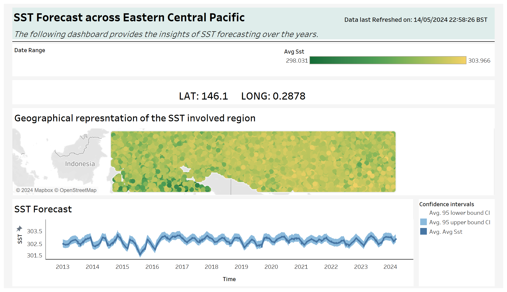
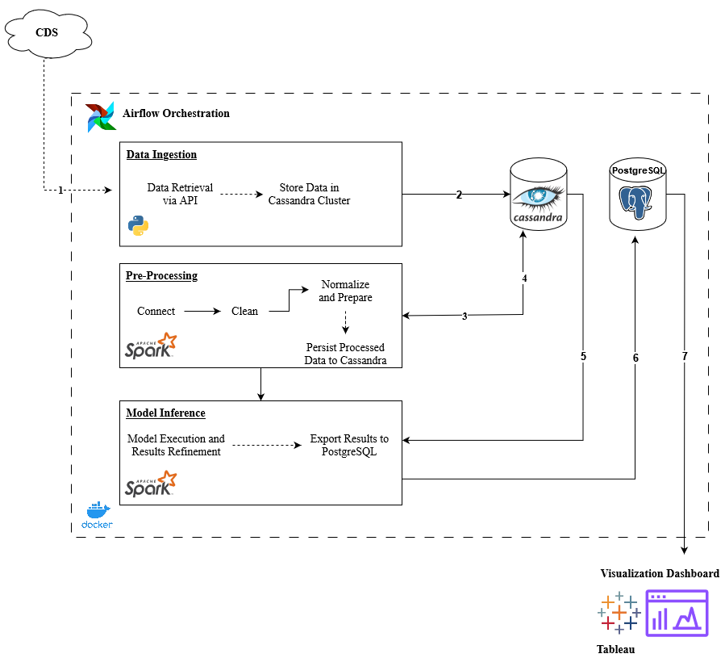

# SST Forecasting Using Big Data Tools

## Project Overview

This project is dedicated to forecasting Sea Surface Temperature (SST) using a sophisticated data pipeline and machine learning models. Leveraging the ERA5 reanalysis hourly data from the Climate Data Store (CDS), our approach employs two forecasting models: Facebook's Prophet and the Random Forest model from Apache Spark's MLib library. This project showcases the integration of big data technologies and their scalability with an increasing influx of data, critical for dynamic environmental forecasting.

### Key Objectives

- **Scalability**: Demonstrate how our big data solution scales with increased data inflow.
- **Comparative Analysis**: Provide a comparative study of the two forecasting models used.
- **Significance**: Highlight the importance of forecasting SST in the context of global climate monitoring and its wider impacts.

## Tools Used

The project utilizes a robust architecture involving several big data tools:
- **Apache Airflow**: Manages the workflow automation.
- **Apache Spark**: Processes data and runs ML models.
- **Apache Cassandra**: Serves as the primary database for storing incoming and processed data.
- **PostgreSQL**: Stores processed data for reporting and visualization.
- **Tableau**: Used for visualizing the forecasting results.

## Screenshots

### Tableau Dashboard
 


## Architecture
 


### Data Pipeline

1. **Data Ingestion**: A Docker service pulls data from the CDS cloud using the CDS API, pushing it to Cassandra. This process is triggered by Apache Airflow.
2. **Data Processing**: Triggered by Airflow, this step involves the Spark data-processing service to handle and prepare data for modeling.
3. **Model Inference**: Within the same Spark data-processing service, the Facebook Prophet model runs, forecasting SSTs with a 95% confidence interval.
4. **Data Storage and Visualization**: Post-modeling, the data is pushed to a PostgreSQL database. A Tableau dashboard connects to this database, refreshing the dashboard with new data for visualization.

## Getting Started

### Prerequisites

Ensure Docker and Docker Compose are installed on your machine. Access to CDS API credentials and necessary configurations for Apache Airflow, Apache Spark, Cassandra, PostgreSQL, and Tableau are also required.

### Installation and Setup

1. **Clone the Repository**
   ```bash
   git clone <repository-url>
   ```

2. **Navigate to Deployment Directory**
   ```bash
   cd path/to/deployment/
   ```

3. **Build and Run the Docker Compose**
   ```bash
   docker-compose up --build -d
   ```

This will start all the necessary services, including launching the Airflow dashboard accessible at `http://localhost:8080`.

## Setting Up Tableau

### Installation
1. **Download Tableau Desktop**: Navigate to the [Tableau Desktop download page](https://www.tableau.com/products/desktop) and install Tableau on your system.

### Connection Setup
2. **Connect to PostgreSQL Database**:
   - Open Tableau and go to **Connect > To a server > PostgreSQL**.

### Install PostgreSQL Driver
3. **Download and Install the PostgreSQL Driver**:
   - Tableau requires a specific driver to integrate with PostgreSQL. Download the Java 8 JDBC driver from [here](https://jdbc.postgresql.org/download/).
   - **Driver Version Compatibility**: Ensure compatibility with Tableau Desktop versions 2021.1 to 2024.1.2.

### Driver Installation
4. **Setup the Driver**:
   - Copy the downloaded `.jar` file to the following directory: `C:\Program Files\Tableau\Drivers`
   - You may need to create this directory if it does not exist.

### Restart and Connect
5. **Restart Tableau**:
   - After installing the driver, restart Tableau for the changes to take effect.

6. **Sign In to PostgreSQL**:
   - Navigate to **Connect > PostgreSQL** and sign in using your credentials.
   - **Credentials**:
     - **Server**: `localhost`
     - **Port**: `5432`
     - **Database**: `<database_name>`
     - **Authentication**: Username and password
     - **Username**: `<username>`
     - **Password**: `<password>`
7. **Loading .twbx file**
    - Download the .twbx file from this [link](https://public.tableau.com/app/profile/nidhi.saini/viz/SST_Dashboard/SSTdashboard?publish=yes ).
    - Open .twbx using Tableau Desktop

## Usage

Initiating the Data Pipeline with Airflow

1. Open a web browser and navigate to http://localhost:8080 to access the Airflow dashboard.
Running the Data Pipeline:

2. In the Airflow dashboard, locate and select the DAG corresponding to the data pipeline. Trigger the DAG to start the pipeline. Monitor the progress directly through the dashboard to ensure each task completes successfully.

3. Once the data pipeline has successfully executed, Tableau, already connected to the updated PostgreSQL database, will automatically refresh the dashboard. Navigate to your Tableau dashboard to view the latest outputs and insights derived from the forecasted SST data.

This sequence ensures a streamlined operation from data processing to visualization, providing up-to-date results on the dashboard for immediate analysis and decision-making.

## Contributors

Sudarsaan Azhagu Sundaram, Preethi Jayakumar, Nidhi Saini, Tushara Rudresh Murthy, Girija Suresh Dahibhate, Sohail Amantulla Patel

## License

This project is licensed under the Creative Commons Attribution-NonCommercial 4.0 International License - see the LICENSE file for details. This restricts the use of this project to academic and other non-commercial purposes only.
See the [LICENSE](LICENSE.md) file for details.
